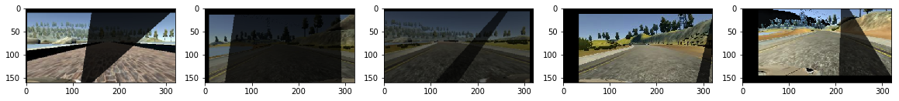
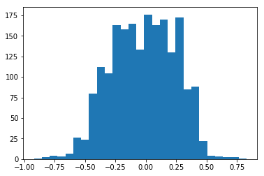

# Behavioral Cloning Project

This project demonstrates implementation of Nvidia model in keras to predict steering angles.

The goal is to teach a Convolutional Neural Network (CNN) to drive a car in a simulator provided by Udacity. The car is equipped with three cameras that provide video streams and records the values of the steering angle, speed, throttle and brake. The steering angle is the only thing that needs to be predicted, but more advanced models might also want to predict throttle and brake. 

## Data

I used primarily Udacity provided data (8036 images in total). Data visualization shows that data is unbalanced and steering angle is more close to zero most of the time.

### Data Augmentation

As the training data is unbalanced, i used data augmentation techniques like adding random brightness, shadows, flipping the angle also translating the image.Also i have used all three images center,left and right to include in DataGenerator.

Sample of images after data augmentation.

And plotting the histogram show more balanced data.

